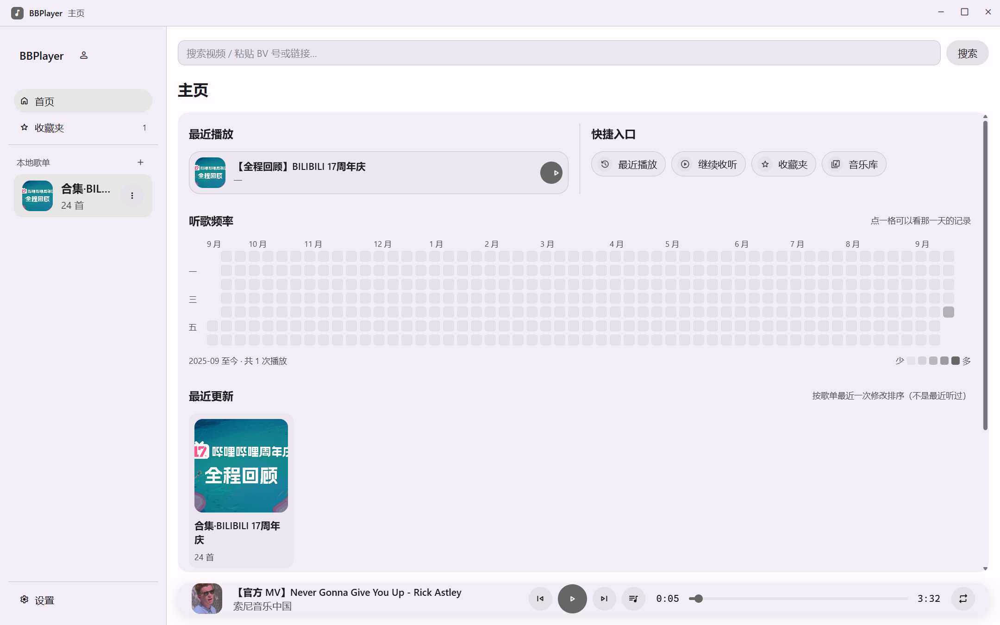
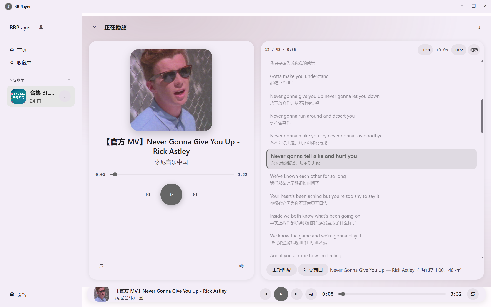
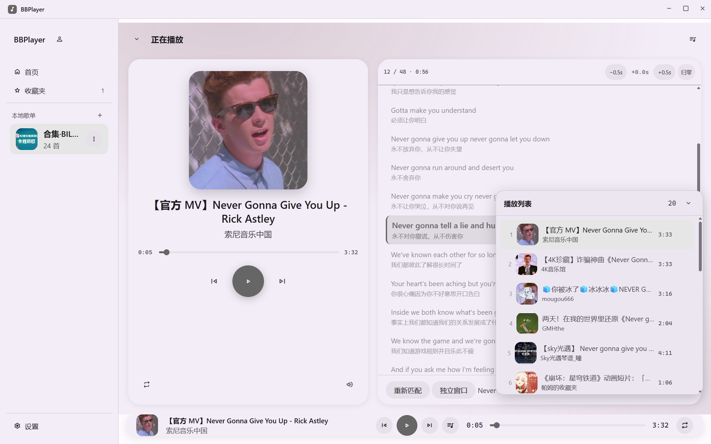
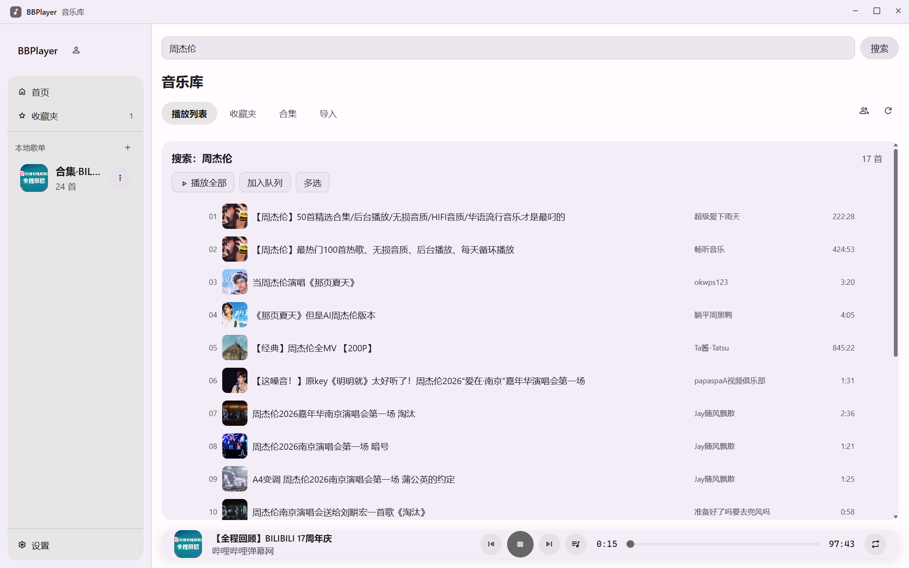
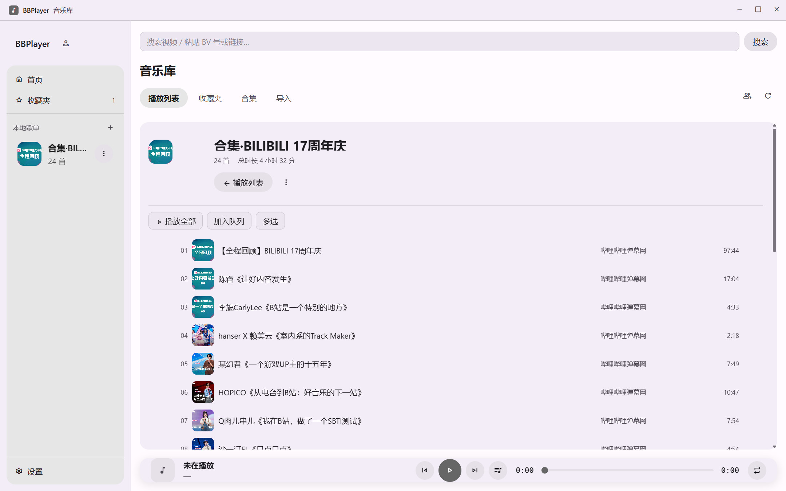
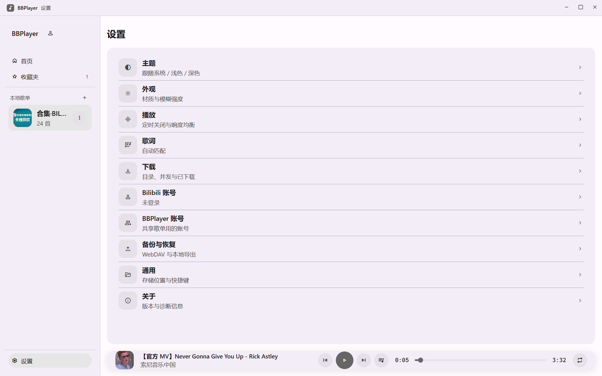

<div align="center">

<h1>BBPlayer Desktop</h1>

一款使用 Electron 构建的本地优先的 Bilibili 桌面音频播放器。更轻量 & 舒服的听歌体验，远离臃肿卡顿的 Bilibili 客户端。


</div>

---

与 [BBPlayer](https://github.com/bbplayer-app/BBPlayer) 移动端共享 [`packages/core`](./packages/core) 的平台无关逻辑，
**数据库结构与备份格式两端互通** —— 桌面端的备份可以直接在手机上恢复，反之亦然。

> 本仓库是 [@roitium](https://github.com/roitium) 的 [bbplayer-app/BBPlayer](https://github.com/bbplayer-app/BBPlayer)
> 中**桌面端部分的独立拆分**，版权归原作者所有（见 [开源许可](#开源许可)）。
> 移动端（React Native）与其余组件仍在上游仓库维护。

## 屏幕截图

|                  首页                  |                     播放器                     |                 播放列表                 |                    搜索                    |                    音乐库                    |                      设置                      |
| :------------------------------------: | :--------------------------------------------: | :--------------------------------------: | :----------------------------------------: | :------------------------------------------: | :--------------------------------------------: |
|  |  |  |  |  |  |

## 主要功能

### 核心播放体验

- **Bilibili 登录**: 支持通过**扫码**、**密码**或手动粘贴 Cookie 登录。凭据经系统密钥库（Electron `safeStorage`）加密落盘，**cookie 从不到达渲染进程**。
- **播放源**: 自由添加本地播放列表，登录账号后也可直接访问账号内**收藏夹**与 UP **合集**。音频由主进程经自定义协议代理（B 站主线 CDN 强制校验 `Referer`，渲染进程设不上去）。
- **导入外部歌单**: 支持粘贴**网易云音乐**歌单链接，逐首搜索、加权打分后匹配到 B 站视频并保存为播放列表。
- **全功能播放器**: 提供播放/暂停、循环、随机、播放队列、响度均衡、断点续播、启动自动播放等功能。
- **搜索**: 智能搜索，支持 BV/AV 号、b23.tv 短链解析。同时提供收藏夹和本地播放列表内搜索。

### 歌词系统

- **支持 SPL**: 支持**逐字进度**、**罗马音注音**及**翻译歌词**展示。
- **智能获取**: 支持自动匹配歌词（网易云 / QQ 音乐 / 酷狗音乐），并支持手动搜索、粘贴 LRC/SPL 文本及偏移量调整。
- **多样展示**: 支持**独立歌词窗口** —— 无边框 + 透明背景 + 置顶悬浮，可用 `Ctrl+Alt+L` 呼出。

### 主题系统

- **浅色 / 深色 / 跟随系统** 三种模式，语义色与字阶来自 [`packages/design-tokens`](./packages/design-tokens) 的 Material Design 3 令牌（主进程生成 CSS 变量下发给渲染进程，不是手抄一份）。
- **封面主色背景**：播放详情页的背景取自当前封面。
- **材质与模糊强度**可调，左栏宽度**可拖拽**并记忆（双击还原）。

### 其他特性

- **下载**: 支持缓存歌曲并离线播放，HTTP `Range` 断点续传 + 完整性校验 + 备用地址回退。
- **共享歌单**: 把歌单分享到 [`apps/backend`](./apps/backend)，别人订阅后**双向同步**（owner / editor 可改，subscriber 只读）。
- **备份与恢复**: ZIP + 原始 SQLite 快照，**与移动端格式互通**。
- **系统集成**: Windows 走 **SMTC**、Linux 走 **MPRIS**；任务栏缩略图按钮（图标运行时零依赖生成）；可选硬件媒体键兜底。
- **实用工具**: 定时关闭、播放历史与听歌频率热力图、多选批量操作。

## 技术栈

- **框架**: Electron
- **数据库**: `node:sqlite`（Electron 内置）+ Drizzle ORM
- **渲染进程**: 原生 DOM —— **没有框架，也没有打包器**，每个模块是 `index.html` 里的普通 `<script>`
- **UI**: Material Design 3
- **核心逻辑**: [`packages/core`](./packages/core)（平台无关，与移动端共用），构建期用 esbuild 打成 CJS 单文件随应用分发

## 项目结构 (Monorepo)

- **[apps/desktop](./apps/desktop)**: BBPlayer 桌面端核心代码（主进程 + 渲染进程 + 验证套件）。
- **[apps/backend](./apps/backend)**: 共享歌单后端（Cloudflare Worker + Hono + Drizzle + Postgres）。
- **[packages/core](./packages/core)**: 平台无关核心 —— DB schema 与迁移、B 站 / 网易云 API、歌词候选、WebDAV、备份格式。
- **[packages/splash](./packages/splash)**: 歌词解析与转换核心库（SPL / LRC）。
- **[packages/design-tokens](./packages/design-tokens)**: Material Design 3 语义色与字阶。
- **[docs](./docs)**: 方案、各阶段施工图、进展与**踩坑记录**。
- **[prototype](./prototype)**: 界面改造的静态 HTML 原型（改主页 / 播放页前先看它）。

## 快速开始

```bash
pnpm install

# 国内网络首次安装需要下载 Electron 二进制（约 142 MB）；Electron ≥ 42 是懒下载，
# 刚装完 dist/ 是空的属于正常现象
ELECTRON_MIRROR=https://registry.npmmirror.com/-/binary/electron/ pnpm install

pnpm --filter @bbplayer/desktop start      # 开窗口运行
```

打包：

```bash
pnpm --filter @bbplayer/desktop build:win     # NSIS 安装版（+ portable，暂不发布）
pnpm --filter @bbplayer/desktop build:linux   # deb / rpm / AppImage（配置在，但未验证，见 TODO）
```

质量检查：

```bash
pnpm lint          # oxlint --type-aware
pnpm type-check    # tsgo --build --noEmit
pnpm check:core    # packages/core 平台无关性守卫
pnpm check:probes  # 探针脚本静态检查
pnpm shots:readme  # 重拍本文档的截图
```

另有 21 个验证套件（1000+ 条断言，含真实播放、真实登录链路、截图巡检），
清单与边界见 [`apps/desktop/README.md`](./apps/desktop/README.md)。

## 平台与状态

**目前只发布 Windows 安装版一个产物。** 其它平台与打包格式都还没到能发的程度，
列在下面的 TODO 里。

- **Windows 10 / 11（x64）**：`BBPlayer-<版本>-win-x64-nsis-setup.exe`，安装版，
  可选安装目录、建桌面与开始菜单快捷方式、在「应用和功能」里注册卸载项。
- **未签名**：SmartScreen 会提示「Windows 已保护你的电脑」→「更多信息」→「仍要运行」。
- 数据在 `%APPDATA%\BBPlayer`；**卸载不会删它**，要彻底清干净得手动删。

## TODO（后续计划）

按优先级排，做完了就往下挪。产品层面的已知限制另见
[`apps/desktop/README.md` 的「已知限制 / 下一步」](./apps/desktop/README.md#已知限制--下一步)。

- [ ] **Linux 产物**（`.deb` / `.rpm` / `.AppImage`）
  - 构建配置在 `apps/desktop/electron-builder.yml` 里是齐的，`build:linux` 能出包，
    也曾在 Debian 12 的 VPS 上真机验过安装 / 运行 / 卸载；
  - **但没发**，因为缺跨发行版验证。已经修掉一个有代表性的坑：
    ALSA 依赖名在新旧发行版之间改过（`libasound2` → `libasound2t64`），
    `deb.depends` 现在写成替代依赖 `libasound2 | libasound2t64`；
  - `.github/workflows/build-desktop.yml` 里那套「构建 + 在
    Debian 12 / Ubuntu 22.04 / 24.04 / Debian 13 四个容器里各装一遍再跑自检」
    **已经写好但一次都没跑过**（开发机是 Windows，没有 docker / WSL），
    所以它现在只在手动触发且显式选择时才跑，不参与发版；
  - 要开始做这一项，第一步就是把它跑绿，绿了再谈发布。
  - 自己构建的话：需要 Node 26 + pnpm，**构建峰值内存超过 3.8 GB**
    （实测 2 GB 的 VPS 必须先补 swap），所以它不适合当常规安装方式。
- [ ] **macOS**：完全没适配，也没做任何打包验证。
- [ ] **代码签名**：Windows 的 NSIS 包未签名，Linux 包同样；签名策略见
      [`docs/DESKTOP_PLAN.md`](./docs/DESKTOP_PLAN.md) Phase 5.3。
- [ ] **自动更新**：`electron-builder.yml` 里有 `publish: generic` 的占位配置，
      electron-builder 也会生成 `latest.yml` / `.blockmap`，但应用**还没接
      `electron-updater`**（依赖里没有它，代码里也没有 `autoUpdater`）。
      在这些接上之前，那两个文件没有任何用途，别传进 release。
- [ ] **portable 免安装版**：`build:win` 会一并产出
      `BBPlayer-<版本>-win-x64-portable.exe`，本版**不发布**。

## 隐私与数据统计

桌面端**不集成**任何统计或崩溃上报 SDK。

### 数据流向

1. **本机**：播放列表、播放历史、下载的歌曲、设置项都存在本机 `userData` 下。
2. **B 站**：搜索、取流、收藏夹与合集同步直接请求 B 站 API。
3. **歌词来源**：自动匹配歌词时会请求网易云 / QQ 音乐 / 酷狗音乐。
4. **共享歌单**：只有在你主动使用该功能时才访问 [`apps/backend`](./apps/backend)（地址可自建）。
5. **WebDAV**：只有在你配置了备份地址后才访问你自己填的服务器。

### 隐私承诺

- **登录凭据不出本机**：B 站 cookie 只存在于主进程，渲染进程拿不到；二维码轮询也在主进程完成。
- **统计代码开源可见**：没有任何隐藏上报。
- **可自建后端**：共享歌单后端地址可配，不强制走官方实例。

## 感谢

本项目开发过程中很多功能和设计的灵感都来自前辈们，包括但不限于：

- [AzusaPlayer](https://github.com/lovegaoshi/azusa-player-mobile)
- [BiliSound](https://github.com/bilisound/client-mobile)
- [Salt Player](https://github.com/Moriafly/SaltPlayerSource)
- [Spotify](https://spotify.com)

以及最重要的：[Bilibili](https://www.bilibili.com/)

在此表示感谢！（鞠躬）

## 开源许可

本项目采用 MIT 许可，见 [LICENSE](./LICENSE)。

原始项目 [BBPlayer](https://github.com/bbplayer-app/BBPlayer) 由 [@roitium](https://github.com/roitium) 创建，
**版权归原作者所有** —— [`LICENSE`](./LICENSE) 里的版权声明（`Copyright (c) 2025 Roitium.`）原样保留，
未做任何改动。本仓库只是其中**桌面端部分的独立拆分**：移动端（React Native）、文档站、
热更新与发版工具等仍在上游仓库维护。

上游仓库：<https://github.com/bbplayer-app/BBPlayer> · 作者主页：<https://github.com/roitium>
